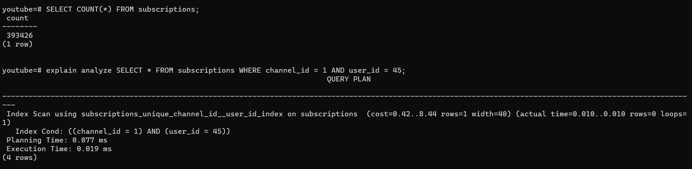
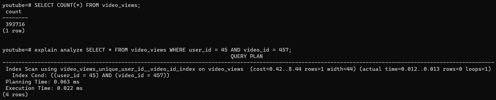
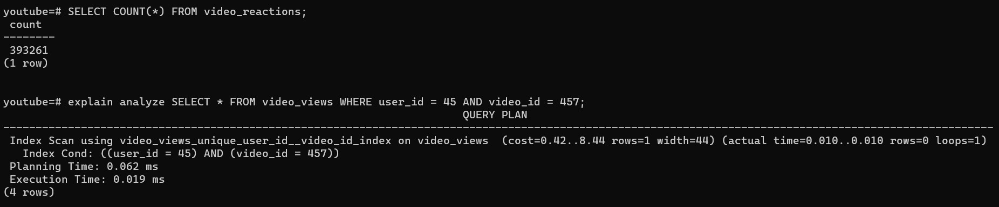
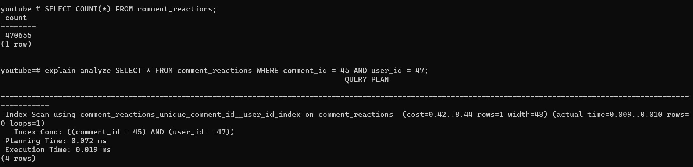
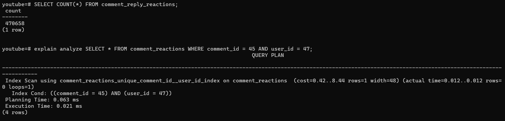

# Performance Insights

### 1. Subscriptions

Total Rows = 393426

Whether a user has subscribed to a channel or not.

Performs a Index Scan on the `subscriptions` table.
Using (channel_id, user_id) as the index.

### 2. Video Views

Total Rows = 393716

Has a user watched a video or not.

Performs a Index Scan on the `video_views` table.
Using (user_id, video_id) as the index.

### 3. Video Reactions

Total Rows = 393261

Has a user reacted to a video or not.

Performs a Index Scan on the `video_reactions` table.
Using (video_id, user_id) as the index.

### 4. Comment Reactions

Total Rows = 470655

Has a user reacted to a comment or not.

Performs a Index Scan on the `comment_reactions` table.
Using (comment_id, user_id) as the index.

### 5. Comment Reply Reactions

Total Rows = 470658

Has a user reacted to a comment reply or not.

Performs a Index Scan on the `comment_reply_reactions` table.
Using (comment_reply_id, user_id) as the index.

