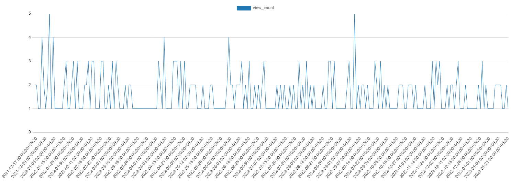

# Queries

#### 1. How will you generate data for line graph of view counts of a video in a day?

It truncates the `created_at` column to day and then counts the number of views in that day.
`date_trunc` is a function in PostgreSQL that truncates the date to a nearest unit based on the argument passed to it.

```sql
SELECT date_trunc('day', created_at) as day, count(*) as view_count
FROM video_views
WHERE video_id = 1
GROUP BY day
ORDER BY day;
```



#### 2. Searching for a video or a channel.

```sql
SELECT id, title, description, url, created_at
FROM videos
WHERE title ILIKE '%heavy%'
ORDER BY created_at DESC
LIMIT 20;

SELECT id, name, handle, description, created_at
FROM channels
WHERE name ILIKE '%rocker%'
ORDER BY created_at DESC
LIMIT 20;
```
