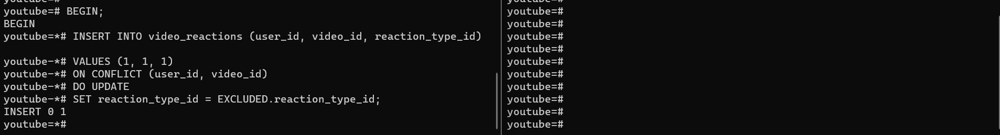
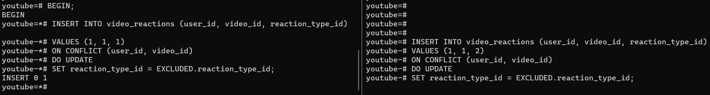
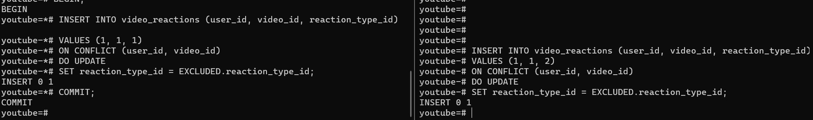
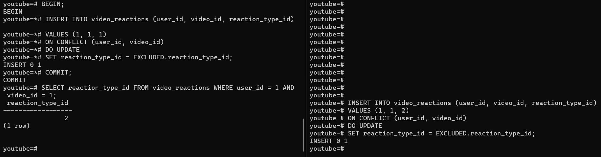

# Transactions

An example of transactions in my project can be shown with the case where user likes and dislikes a video, comment or a comment_reply quickly.

Suppose we want to like a video with the following varaiables.

- user_id = 1
- video_id = 1
- reaction_type_id = 1 (1 is for like, 2 is for dislike)

I have opened two terminals side-by-side. In the first terminal, I will start a transaction to like a video and wait.
In the second terminal, I write a query to dislike the same video and wait.
Then, I will commit the transaction in the first terminal.

### Step 1: Start a transaction in the first terminal

### Step 2: Insert a like in the first terminal

### Step 3: Write a query to dislike the same video in the second terminal

We see that after pressing `ENTER` the query is waiting for the transaction to be committed or rolled back.

### Step 4: Commit the transaction in the first terminal

Now we see that the query in the second terminal is executed.

### Step 5: Check the result in the first terminal

We see that video is disliked overall (reaction_type_id = 2 is for dislike)

